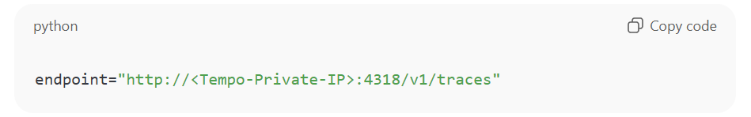
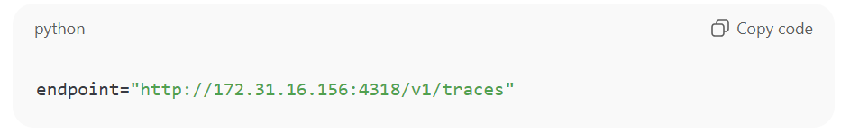

# Process of Traces
# Step 1: Launch 2 EC2 Instances

## EC2-1 (Tempo Server)
* Name: tempo-server
* OS: Ubuntu 22.04
* Security Group:
* Inbound:
    * 3200 → For Tempo UI/API
    * 4318 → For OTLP HTTP endpoint (receives traces)
    * 22 → For SSH
* Outbound: Allow all

## EC2-2 (Python App)
* Name: tracing-app
* OS: Ubuntu 22.04
* Security Group:
* Inbound:
    * 5000 → Flask app
    * 22 → SSH
* Outbound: Allow all
* Make sure EC2-2 can reach EC2-1 on port 4318

✅ Important: Both instances must be in the same VPC and subnet (or connected through routing).

# Step 2: Install Grafana and Tempo & Configure Tempo (on EC2-1)

* by using Grafana + Tempo.sh file
* Run the shell script by using below command
    * sh Grafana+Tempo.sh

# Step 3: Install OpenTelemetry  & Configure Python Flask App (on EC2-2)

* By using OpenTelemetry+PythonFlaskApp.sh file
* Run the shell script by using below command
    * sh OpenTelemetry+PythonFlaskApp.sh

* --> Modify the Flask app to send traces to Tempo’s private IP (from Step 2):
Edit the line in app.py:

Example:

# Step 4: Verify Traces in Tempo 
* if we want to check the listeners by using below command
    * ss -tulnp | grep tempo

1. Grafana is installed on EC2-1:
    1. Access Grafana: http://<EC2-1-Public-IP>:3000
    2. Login (default): admin / admin
    3. Go to Settings → Data Sources → Add Data Source → Tempo
    4. Set URL: http://localhost:3200
    5. Click Save & Test
* View traces in Explore → Tempo and search for your spans (like home-span, users-span)

# Step 5: Validate End-to-End Flow
* Visit your app multiple times by hitting the URL
* Example like:
    * http://<EC2-2-Public-IP>:5000/ 

# Port Number
1. Grafana Port Number is --> 3000
2. Tempo Port Number is --> 3200
3. OpenTelemetry(OTLP) Port Number is --> 4318
4. Python Flask Port Number is --> 5000